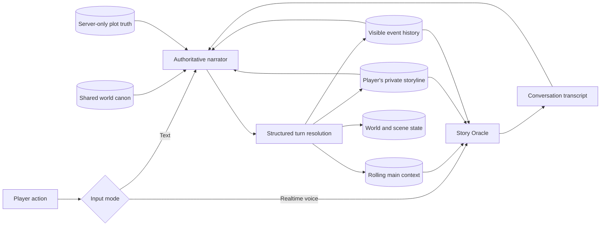

# Yggdrasil Worlds

**A persistent multiplayer storytelling engine where every player becomes part of the canon.**

Yggdrasil Worlds is the interactive-story half of **ReactJK**, built for the Pocket FM hackathon. Its companion, **Kalamish**, is the creator workspace where authors develop long-form fiction with multi-stage AI orchestration and semantic canon memory. Together they form one story lifecycle: Kalamish writes the universe, and Yggdrasil makes it playable.

Unlike a conventional chatbot, a World remembers. Its setting, rules, locations, NPCs, plot threads, player-specific arcs, and shared consequences are persisted as structured state and used to resolve every new turn.

## Repository layout

```text
.
├── app/                 Yggdrasil Next.js application and APIs
├── components/          Yggdrasil interface and Story Oracle
├── lib/                 Yggdrasil narrative, auth, and persistence layers
└── kalamish/
    ├── backend/         FastAPI, LangGraph agents, Postgres/pgvector memory
    └── frontend/        React, Vite, Monaco author workspace
```

The full Kalamish documentation and setup guide live in [`kalamish/README.md`](./kalamish/README.md).

## What it does

- Create public or password-protected story worlds from a flexible ruleset.
- Start curated solo or cooperative scenarios.
- Generate a world bible with locations, NPCs, factions, plot threads, and hidden plot truth.
- Give every participant a distinct protagonist, private storyline, knowledge, relationships, inventory, and condition.
- Resolve free-text actions through a model-agnostic narrator powered by OpenAI or Gemini.
- Keep one evolving shared canon while preserving each player's private perspective.
- Synchronize multiplayer state on load and after actions without requiring WebSockets.
- Talk naturally to the **Story Oracle** through OpenAI's Realtime API.
- Commit an Oracle conversation as one canonical action through the normal narrator pipeline.

## The narrative architecture



The Story Oracle receives the complete canon visible to the current player, including their personal arc and private chronicle. It never receives hidden plot truth or another player's secrets. When the conversation ends, its transcript is passed to the authoritative narrator, which reconciles the chosen action against the full world state and persists the result.

## State model

Each World stores:

- A founding world summary and rolling `mainContext`
- Rules, tone, power system, factions, and play protocol
- Public story state and unresolved plot threads
- A server-only plot bible containing secrets and planned reversals
- Structured locations, NPCs, and shared scenes
- An ordered event chronicle with world, scene, and private visibility
- One complete protagonist profile and evolving private state per player

The narrator returns structured JSON containing narration, suggested moves, updated player state, world memory, story state, plot-thread changes, NPC changes, and any scene/world event. Validation runs before anything is persisted.

## Stack

- Next.js 15 App Router
- React 19 and Tailwind CSS
- Firebase Authentication with anonymous sessions
- Cloud Firestore and Firebase Admin
- OpenAI Responses/Chat adapter or Google Gemini
- OpenAI Realtime API for the voice-first Story Oracle
- Databricks Apps deployment

## Run locally

Requirements:

- Node.js 20+
- A Firebase project with Firestore and Anonymous Authentication enabled
- At least one configured narrator provider

Create `.env.local`:

```bash
FIREBASE_SERVICE_ACCOUNT={"type":"service_account",...}
NEXT_PUBLIC_FIREBASE_API_KEY=
NEXT_PUBLIC_FIREBASE_AUTH_DOMAIN=
NEXT_PUBLIC_FIREBASE_PROJECT_ID=
NEXT_PUBLIC_FIREBASE_APP_ID=

LLM_PROVIDER=openai
OPENAI_API_KEY=
OPENAI_MODEL=gpt-5.6-luna

# Optional Gemini narrator
GEMINI_API_KEY=
GEMINI_MODEL=gemini-2.0-flash

# Optional Story Oracle overrides
OPENAI_ORACLE_REALTIME_MODEL=gpt-realtime-2.1-mini
OPENAI_ORACLE_VOICE=marin
```

Then:

```bash
npm install
npm run dev
```

Open [http://localhost:3001](http://localhost:3001).

Useful checks:

```bash
npx tsc --noEmit
npm run build
```

## API surface

| Route | Purpose |
| --- | --- |
| `GET /api/worlds` | Browse available worlds |
| `POST /api/worlds/create` | Generate and persist a new world |
| `POST /api/worlds/draft` | Expand a creator idea into editable world parameters |
| `POST /api/worlds/preset` | Start a solo or cooperative preset |
| `GET /api/worlds/:id` | Fetch player-visible world, scene, and chronicle state |
| `POST /api/worlds/:id/join` | Create or resume a protagonist |
| `POST /api/worlds/:id/action` | Resolve and persist one canonical turn |
| `POST /api/worlds/:id/oracle` | Establish an authenticated Realtime voice session |

Firebase ID tokens are sent through `X-Firebase-Auth` in production because Databricks ingress reserves the standard `Authorization` header. The server retains Bearer-token compatibility for local and conventional hosting.

## Deploy to Databricks Apps

The repository includes [`app.yaml`](./app.yaml) and [`databricks.yml`](./databricks.yml). Runtime values are referenced through Databricks secrets; secret values are never stored in Git.

With an authenticated Databricks CLI profile:

```bash
databricks bundle validate -p yggdrasil
databricks apps deploy -p yggdrasil --skip-validation
```

Current deployment:

**https://yggdrasil-worlds-7474650718500342.aws.databricksapps.com**

Databricks Apps access is protected by Databricks SSO. The included bundle grants `CAN_USE` to the workspace `users` group.

## Privacy and continuity rules

- Shared memory contains only player-visible canonical facts.
- Hidden plot truth stays server-side until earned in the story.
- A player's private arc and deliberation are never exposed to other players.
- Other protagonists remain autonomous; the narrator cannot choose their actions.
- Rumors, clues, and confirmed facts retain distinct certainty levels.
- Oracle speech is provisional until the player chooses **End & Continue**.

## Product vision

Yggdrasil turns passive fiction into a living social format: stories that can be played alone, explored with friends, debated, investigated, escaped, survived, and continuously expanded. The long-term goal is a platform where communities do not merely consume a story—they inhabit and remember it together.
