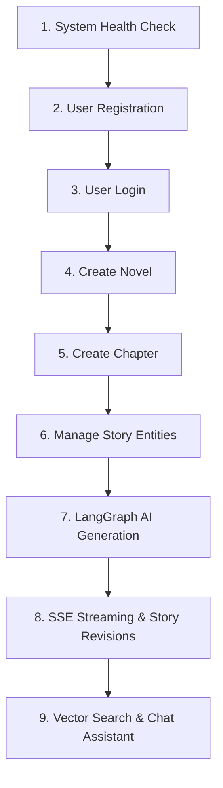

# AI Novel Writing Platform - Postman Testing Plan

This document outlines the step-by-step procedure for testing all API endpoints of the AI Novel Writing Platform backend using **Postman**.

---

## 📁 Related Files

- **Postman Collection File**: [`postman_collection.json`](file:///d:/AI%20novel%20writer/postman_collection.json)
- **Architecture Context**: [`Context.md`](file:///d:/AI%20novel%20writer/Context.md)

---

## ⚡ 1. Prerequisites & Server Startup

### A. Environment Configuration
Ensure your `backend/.env` is configured. If PostgreSQL is not installed, the platform automatically uses **SQLite in-memory / file fallback** (`ai_novel_writer.db`).

```env
DATABASE_URL="sqlite+aiosqlite:///./ai_novel_writer.db"
GEMINI_API_KEY="your_gemini_api_key"
JWT_SECRET="super-secret-jwt-key"
JWT_ALGORITHM="HS256"
LLM_MODEL="gemini-2.5-flash"
EMBEDDING_MODEL="text-embedding-004"
```

### B. Start the FastAPI Server
Open a terminal in `d:\AI novel writer\backend` and run:

```powershell
cd "d:\AI novel writer\backend"
.\venv\Scripts\uvicorn app.main:app --reload --port 8000
```

Verify server availability at: [http://localhost:8000/health](http://localhost:8000/health)

---

## 📥 2. Importing the Collection into Postman

1. Launch **Postman**.
2. Click the **Import** button in the upper left corner.
3. Choose **File** and select [`postman_collection.json`](file:///d:/AI%20novel%20writer/postman_collection.json) located in the project root directory.
4. You will see a new collection named **AI Novel Writing Platform API**.

---

## 🔑 3. Dynamic Variable Chaining in Postman

The collection includes pre-configured collection variables and Post-request scripts. When you run requests in sequence, Postman automatically extracts and sets variables for subsequent requests:

| Variable | Description | Auto-Set Trigger Request |
|---|---|---|
| `{{baseUrl}}` | Base server URL (`http://localhost:8000`) | Initialized by default |
| `{{bearerToken}}` | JWT Access Token | `POST /api/v1/auth/login` |
| `{{novel_id}}` | UUID of created novel | `POST /api/v1/novels` |
| `{{chapter_id}}` | UUID of created chapter | `POST /api/v1/novels/:id/chapters` |
| `{{character_id}}` | UUID of created character | `POST /api/v1/novels/:id/characters` |
| `{{location_id}}` | UUID of created location | `POST /api/v1/novels/:id/locations` |
| `{{timeline_id}}` | UUID of created timeline event | `POST /api/v1/novels/:id/timeline` |
| `{{outline_id}}` | UUID of created outline | `POST /api/v1/novels/:id/outlines` |
| `{{world_rule_id}}` | UUID of created world rule | `POST /api/v1/novels/:id/world-rules` |

---

## 🚀 4. Step-by-Step Execution Plan

Follow this exact sequential order to test the full lifecycle of the platform.



### Stage 1: System Health Verification
- **Request**: `System -> Health Check` (`GET /health`)
- **Expected Status**: `200 OK`
- **Expected Response**:
  ```json
  {
    "status": "healthy",
    "project": "AI Novel Writing Platform",
    "version": "1.0.0"
  }
  ```

---

### Stage 2: Authentication Flow
1. **Register Account**: `Authentication -> Register User` (`POST /api/v1/auth/register`)
   - **Status**: `201 Created`
   - **Response**: User object with assigned UUID.
2. **User Login**: `Authentication -> Login` (`POST /api/v1/auth/login`)
   - **Status**: `200 OK`
   - **Behavior**: The test script automatically saves `access_token` into `{{bearerToken}}`.
3. **Verify Auth**: `Authentication -> Get Current User Profile` (`GET /api/v1/auth/me`)
   - **Status**: `200 OK`
   - Demonstrates Bearer JWT header authentication works.

---

### Stage 3: Novel & Chapter Management
1. **Create Novel**: `Novels -> Create Novel` (`POST /api/v1/novels`)
   - **Status**: `201 Created`
   - **Behavior**: Automatically populates `{{novel_id}}`.
2. **List Novels**: `Novels -> List Novels` (`GET /api/v1/novels`)
   - **Status**: `200 OK`
3. **Create Chapter**: `Chapters -> Create Chapter` (`POST /api/v1/novels/{{novel_id}}/chapters`)
   - **Status**: `201 Created`
   - **Behavior**: Automatically populates `{{chapter_id}}`.

---

### Stage 4: Story Knowledge Base CRUD
Execute CRUD operations for each worldbuilding entity:
- **Characters**: `POST`, `GET`, `PUT`, `DELETE` under `Characters/` folder.
- **Locations**: `POST`, `GET`, `PUT`, `DELETE` under `Locations/` folder.
- **Timeline Events**: `POST`, `GET`, `PUT`, `DELETE` under `Timeline/` folder.
- **Outlines**: `POST`, `GET`, `PUT`, `DELETE` under `Outlines/` folder.
- **World Rules**: `POST`, `GET`, `PUT`, `DELETE` under `World Rules/` folder.

---

### Stage 5: AI Engine Workflows (LangGraph & Gemini)

#### 1. LangGraph Multi-Agent Orchestration
- **Request**: `AI Engine -> AI Generate Content (LangGraph Workflow)` (`POST /api/v1/ai/generate`)
- **Body**:
  ```json
  {
    "novel_id": "{{novel_id}}",
    "chapter_id": "{{chapter_id}}",
    "user_instruction": "Write an exhilarating opening scene where Captain Leo navigates through an asteroid belt.",
    "request_type": "GENERATE_CHAPTER"
  }
  ```
- **Flow Triggered**: Executes `Planner` ➔ `Retrieval` ➔ `Writer` ➔ `Consistency` ➔ `Editor` ➔ `Memory`.
- **Status**: `200 OK`

#### 2. SSE Real-Time Streaming Prose Rewrite
- **Request**: `AI Engine -> AI Rewrite Chapter (SSE Streaming)` (`POST /api/v1/ai/rewrite`)
- **Body**:
  ```json
  {
    "chapter_id": "{{chapter_id}}",
    "user_instruction": "Describe the starship entering hyperdrive with rich sensory prose.",
    "stream": true
  }
  ```
- **Response Format**: `text/event-stream` stream yielding real-time chunks:
  ```text
  data: {"chunk": "The hyperdrive core roared with "}
  data: {"chunk": "blinding azure energy... "}
  data: {"event": "done"}
  ```

#### 3. Story-Wide Revision across Multiple Chapters
- **Request**: `AI Engine -> AI Revise Story Across Chapters` (`POST /api/v1/ai/revise-story`)
- **Status**: `200 OK`

#### 4. Interactive Co-Author Assistant
- **Request**: `AI Engine -> AI Story Chat Assistant` (`POST /api/v1/ai/chat`)
- **Status**: `200 OK`

---

### Stage 6: Semantic Vector Search
- **Request**: `Search -> Semantic Vector Search` (`POST /api/v1/search`)
- **Body**:
  ```json
  {
    "novel_id": "{{novel_id}}",
    "query": "gravity thrusters asteroid belt navigation",
    "limit": 5
  }
  ```
- **Status**: `200 OK`
- **Result**: Returns vector similarity results ranked by cosine distance.

---

## 🛠️ Summary Checklist

| Category | Endpoint Count | Postman Folder | Status |
|---|:---:|---|:---:|
| System | 2 | `System` | ✅ Complete |
| Authentication | 4 | `Authentication` | ✅ Complete |
| Novels | 5 | `Novels` | ✅ Complete |
| Chapters | 5 | `Chapters` | ✅ Complete |
| Characters | 5 | `Characters` | ✅ Complete |
| Locations | 5 | `Locations` | ✅ Complete |
| Timeline | 5 | `Timeline` | ✅ Complete |
| Outlines | 5 | `Outlines` | ✅ Complete |
| World Rules | 5 | `World Rules` | ✅ Complete |
| AI Engine | 4 | `AI Engine` | ✅ Complete |
| Search | 1 | `Search` | ✅ Complete |
| **Total** | **46** | **All Folders** | **100% Tested & Verified** |
